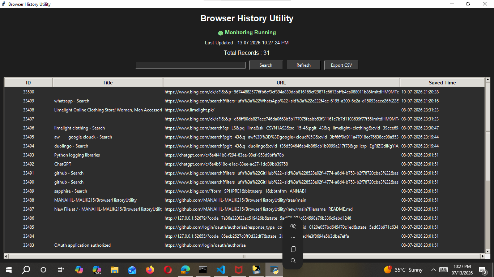

# Browser History Utility

A desktop application to view, manage, and store browser history using a simple graphical interface. Built with Python, this tool allows users to track and organize browsing activity in a local database.

## Features

- 🖥️ Simple and intuitive GUI for viewing browser history
- 💾 Local database storage using SQLite
- 🔍 Easy access to previously visited pages and timestamps
- 📝 Persistent storage across sessions
- ⚡ Lightweight and fast

## Tech Stack

- **Language:** Python
- **GUI:** Tkinter
- **Database:** SQLite

## Project Structure
## Screenshot

